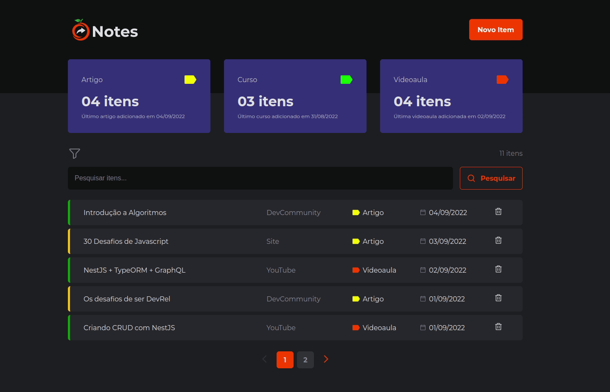

<h1 align="center">Orange Notes</h1>
<div align="center" id="top"> 
  <h2 align="center">Versão Web</h2>
  
  <h2 align="center">Versão Responsiva</h2>
  

&#xa0;

  <!-- <a href="https://orangenotes.netlify.app">Demo</a> -->
</div>

<p align="center">
  

  

  

  

</p>

<!-- Status -->

<!-- <h4 align="center">
	🚧  Orange Notes 🚀 Under construction...  🚧
</h4>

<hr> -->

<p align="center">
  <a href="#dart-about">About</a> &#xa0; | &#xa0;   
  <a href="#rocket-technologies">Technologies</a> &#xa0; | &#xa0;
  <a href="#white_check_mark-requirements">Requirements</a> &#xa0; | &#xa0;
  <a href="#checkered_flag-starting">Starting</a> &#xa0; | &#xa0;
  <a href="#memo-license">License</a> &#xa0; | &#xa0;
  <a href="https://github.com/wsasouza" target="_blank">Author</a>
</p>

<br>

## :dart: About

Projeto desenvolvido para o esquenta do Programa de Formação da FCamara.
Nesta primeira versão inicial do MVP os esforços foram focados na funcionalidade de salvar e categorizar os dados para estudo.

## :rocket: Technologies

The following tools were used in this project:

- [React](https://pt-br.reactjs.org/)
- [TypeScript](https://www.typescriptlang.org/)

## :white_check_mark: Requirements

Before starting :checkered_flag:, you need to have [Git](https://git-scm.com) and [Node](https://nodejs.org/en/) installed.

## :checkered_flag: Starting

```bash
# Clone this project
$ git clone https://github.com/wsasouza/orange-notes

# Access
$ cd orange-notes

# Install dependencies
$ yarn

# Run the server
$ yarn dev:server

# The server will initialize in the <http://localhost:3001>

# Run the project
$ yarn dev

# The project will initialize in the <http://localhost:5173>
```

## :memo: License

This project is under license from MIT. For more details, see the [LICENSE](LICENSE.md) file.

Made with :heart: by <a href="https://github.com/wsasouza" target="_blank">Walter Santos de Andrade Souza</a>

&#xa0;

<a href="#top">Back to top</a>
